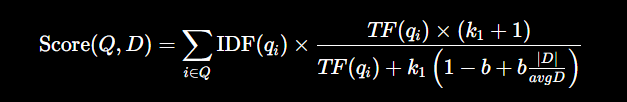

# Week 3 – Day 1 Notes
## BM25, Hybrid Search & Reciprocal Rank Fusion

---

# 1. What is Sparse Retrieval?

Sparse retrieval is a traditional search method that finds documents by matching exact keywords between the query and the document.

It is called "sparse" because each document is represented by a very large vector where most values are zero. Only the words that actually appear in the document have non-zero values.

### Example

Query:
```
attention transformers
```

Document:
```
Transformers use attention mechanisms.
```

Since both words appear exactly, the document receives a high score.

### Advantages
- Very fast
- Finds exact keywords
- Excellent for IDs, error codes, product names, legal documents

### Disadvantages
- Cannot understand meaning
- Cannot match synonyms
- Misses paraphrased content

---

# 2. What is Dense Retrieval?

Dense retrieval represents documents and queries as dense embedding vectors created by a neural network.

Instead of matching words, it compares the meanings of documents.

### Example

Query:
```
car
```

Document:
```
automobile
```

Even though the words are different, embeddings recognize they have similar meaning.

### Advantages
- Understands meaning
- Finds synonyms
- Finds paraphrases
- Better for natural language questions

### Disadvantages
- Can miss exact keywords
- May confuse similar concepts
- Computationally more expensive

---

# 3. What is Lexical Search?

Lexical search retrieves documents by matching exact words.

It does not understand context or meaning.

Example:

Query:
```
car
```

Document:
```
automobile
```

No match because the words are different.

---

# 4. What is Semantic Search?

Semantic search retrieves documents based on meaning rather than exact words.

It uses embeddings and vector similarity.

Example:

Query:
```
car
```

Document:
```
automobile
```

The document is retrieved because both words have similar meanings.

---

# 5. What is Exact Match Retrieval?

Exact match retrieval returns documents only if they contain the exact query terms.

Useful for:
- Error codes
- Product IDs
- Version numbers
- Legal references
- Model numbers

Example:
```
HTTP 404
RTX 5090
CVE-2025-1234
```

---

# 6. What is Term Frequency (TF)?

Term Frequency measures how many times a query word appears inside a document.

Formula:

TF = Number of occurrences of the word in the document

Example:

Document:
```
attention attention attention transformers
```

Query:
```
attention
```

TF = 3

Higher TF usually means the document is more relevant.

---

# 7. What is Inverse Document Frequency (IDF)?

IDF measures how rare a word is across all documents.

Rare words receive higher importance.

Common words receive lower importance.

Formula:

IDF = log(Total Documents / Documents containing the term)

Example:

Word:
```
the
```

Appears in almost every document.

Low IDF.

Word:
```
transformers
```

Appears in very few documents.

High IDF.

---

# 8. What is TF-IDF?

TF-IDF combines:

- Term Frequency (TF)
- Inverse Document Frequency (IDF)

Formula:

TF-IDF = TF × IDF

A word receives a high score if:
- It appears many times in one document
- It appears in very few documents overall

---

# 9. Why is TF-IDF not enough?

TF-IDF has several limitations:

- Treats repeated words as linearly more important.
- Does not properly normalize document length.
- Repeated words can dominate the score.
- Does not understand meaning or synonyms.

---

# 10. What is BM25?

BM25 is an improved version of TF-IDF.

It improves ranking by:

- Using TF saturation
- Normalizing document length
- Giving more realistic scores

BM25 is the standard lexical retrieval algorithm used in many search engines.

BM25 Formula

### Formula



---

## Components

### Score(Q, D)

The final BM25 relevance score of document **D** for query **Q**.

---

### Σ (Summation)

Add the score for every query term.

If the query contains:

```
attention transformers
```

Compute a score for **attention** and another for **transformers**, then add them.

---

### IDF(qᵢ)

Inverse Document Frequency of query term **qᵢ**.

Measures how rare the word is.

- Rare word → Higher score
- Common word → Lower score

---

### TF(qᵢ, D)

Number of times query term **qᵢ** appears in document **D**.

Higher TF generally increases relevance.

---

### k₁

Controls **Term Frequency Saturation**.

- Small k₁ → Repeated words quickly stop helping.
- Large k₁ → Repeated words continue increasing the score for longer.

Typical value:

```
1.2–2.0
```

---

### b

Controls **Document Length Normalization**.

- b = 0 → Ignore document length.
- b = 1 → Fully normalize document length.

Typical value:

```
0.75
```

---

### |D|

Length of the current document.

Usually measured as the total number of words (tokens).

---

### avgdl

Average document length across the entire collection.

Used to compare whether the current document is shorter or longer than average.


---

# 11. What is Term Frequency Saturation?

Repeated occurrences of a word become less important after a certain point.

Example:

First occurrence:
Very important

Second occurrence:
Helpful

Twentieth occurrence:
Almost no additional benefit

BM25 models this behavior naturally.

---

# 12. What does k1 control?

k1 controls term frequency saturation.

Small k1:
Repeated words quickly stop increasing the score.

Large k1:
Repeated words continue increasing the score for longer.

Typical value:
```
1.2 – 2.0
```

---

# 13. What does b control?

b controls document length normalization.

b = 0
Ignore document length.

b = 1
Fully normalize document length.

Typical value:
```
0.75
```

---

# 14. BM25 vs TF-IDF

TF-IDF

- Simple
- Linear TF
- Weak document length normalization

BM25

- Better ranking
- TF saturation
- Strong document length normalization
- Used in production search engines

---

# 15. When does BM25 fail?

BM25 fails when:

- Synonyms are used
- Meaning is more important than exact words
- Documents are heavily paraphrased

Example:

Query:
```
car
```

Document:
```
automobile
```

BM25 may fail because the exact word "car" is missing.

---

# 16. What is Hybrid Search?

Hybrid Search combines:

- BM25 (keyword search)
- Dense Retrieval (semantic search)

Both searches run independently.

Their results are combined into one ranked list.

Advantages:

- Exact keyword matching
- Semantic understanding
- Higher retrieval accuracy
- Better RAG performance

---

# 17. Why is Hybrid Search better?

BM25 finds:

- Error codes
- Product names
- IDs
- Exact phrases

Dense Retrieval finds:

- Synonyms
- Similar meaning
- Paraphrases
- Related concepts

Combining both provides the best retrieval quality.

---

# 18. What is Reciprocal Rank Fusion (RRF)?

Reciprocal Rank Fusion combines multiple ranked search results into a single ranking.

Instead of comparing scores, it compares ranks.

Formula:

RRF Score = Σ 1 / (k + rank)

where:

- rank = position in the ranked list
- k is usually 60

Documents appearing near the top of multiple rankings receive the highest final score.

---

# 19. Why is RRF used?

Different retrieval methods produce scores on different scales.

Instead of averaging scores, RRF combines rankings.

Benefits:

- Simple
- Robust
- No score normalization needed
- Works well for hybrid search

---


# 20. Parametric Memory

Knowledge stored inside the model's weights.

Characteristics:
- Learned during training
- Cannot be updated easily
- May become outdated

Example:
ChatGPT's internal knowledge.

---

# 21. Non-Parametric Memory

Knowledge stored outside the model.

Examples:
- Documents
- Databases
- PDFs
- Vector Databases

The retriever searches this external knowledge during inference.

---